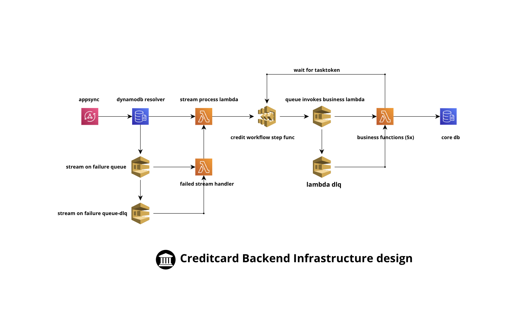
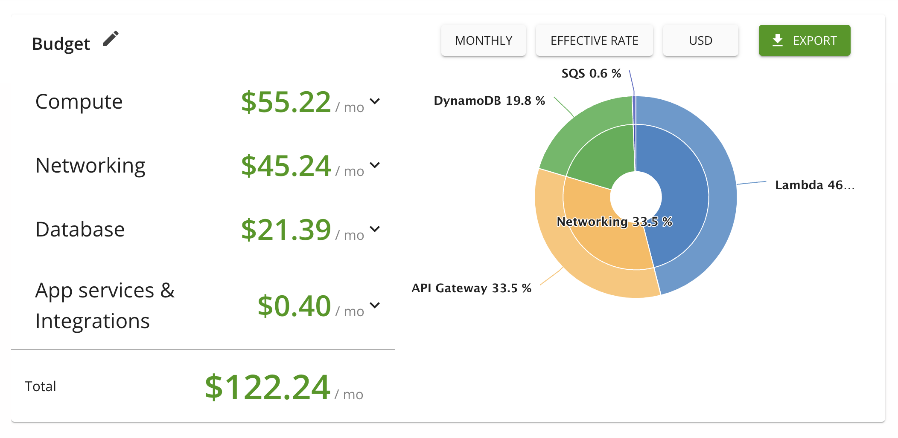

## Credit Card Application System Backend 
![GitHub Actions]
### Introduction
This is generic a credit card application built with serverless technology. 

### Purpose and Scope:

The purpose of this project is to build a generic serverless application for credit card application. It can be used for other types of application as well. All you need is to update the `schema.graphql` in the [schema](schema/schema.graphql) folder to suit your need. You should also modify the step function definition file `templates/credit-card-app-stfn-def.tpl` from the [template](templates/credit-card-app-stfn-def.tpl) folder. 

### Technology Stack:

This application is built with [NodeJS](https://nodejs.org/), [Terraform](https://www.terraform.io/), [AWS Appsync](https://aws.amazon.com/appsync/), [AWS Lambda](https://aws.amazon.com/lambda/), [AWS Step Functions](https://aws.amazon.com/step-functions/), [Amazon DynamoDB](https://aws.amazon.com/dynamodb/), and [Amazon SQS](https://aws.amazon.com/sqs/). The deployment pipeline is managed through [GitHub Actions](https://github.com/features/actions).

### Architecture Overview:

The process begins with AppSync, which acts as the entry point for incoming credit card applications. Once an application is received, it triggers a DynamoDB stream. This stream is configured to invoke a Lambda function — the "stream process Lambda" — designed to begin the state machine process for handling the credit application.

### Scalability and Reliability:

The system is designed with robustness in mind, utilizing DLQs (Dead Letter Queues) at various points. These DLQs ensure that if a message fails to be processed successfully, it is not lost but rather redirected to a DLQ. This allows for the message to be re-driven into the process once the issue that caused the failure is resolved, thus enhancing the system's reliability.

### Security Measures:

#### Configuration: 
The API key authentication is configured directly in the AWS AppSync console or via infrastructure as code using Terraform. You can specify the expiry date and manage the lifecycle of the key programmatically.

#### Distribution: 
Once generated, the API key must be securely distributed to the clients that will use it. This step is crucial and should be handled with care to avoid unauthorized access.

#### Monitoring: 
AWS CloudWatch can be integrated to monitor the usage of the API key, providing insights into the API's usage patterns and identifying any unusual activities that may indicate a security threat.

### Project Status and Roadmap:

The basic features of this project is full functional and deployable, nevertheless, it is still under ongoing development, for example, the business lambda functions are currently only boilerplate code. The future vision of this project is to include apigee for security,  datadog and splunk for observability, and adding integration testing to make project more robust. There will also be a automatic self healing system that will be included to handle sqs redrive systematically. 

### Documentation and Resources:

Currently there is no documentation available. 

### Pricing projection
The following diagram is a rough estimate of monthly cost of running this system. daily request counts are not accurate, the result is only based on huestic, please take a grain of salt and do your due diligence when you plan to run this application on AWS. 

### License:

This project is released under the MIT License. This permissive license allows users and contributors to freely use, modify, distribute, and sell the software as part of their own projects with minimal restrictions. The MIT License is short and to the point; it lets people do anything they want with your code as long as they provide attribution back to you and don’t hold you liable.

### Acknowledgments:

We extend our deepest gratitude to all the contributors who have dedicated their time and expertise to this project. Special thanks are given to any organizations and individuals who have supported us throughout the development process. Your collaboration and support have been invaluable to the success of this open-source initiative.
